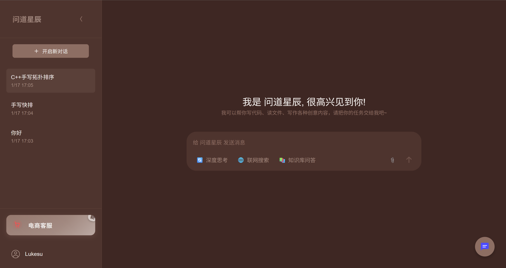
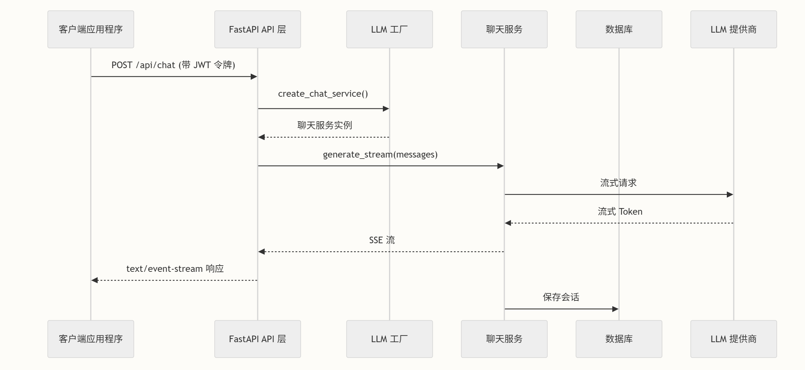

# 基于大语言模型构建的智能客服系统

一个基于 FastAPI 和 Vue 3 构建的前后端分离的智能客服助手项目，支持多种大语言模型，如DeepSeek V3，Qwen2.5系列，Llama3系列等。涵盖了 Agent、RAG 在智能客服领域的主流应用落地需求场景。 




## 功能特性

### 1. 通用问答能力
- **支持 DeepSeek V3 在线API**
- **支持 使用 Ollama 接入任意对话模型，如Qwen2.5系列，Llama3系列**
- **灵活的模配置**

### 2. 深度思考能力
- **支持 DeepSeek R1 在线API**
- **支持 使用 Ollama 接入任意 Deepseek r1 模型系列**
- **灵活的模配置**


### 3. ollama 性能测试工具
- 单请求性能测试
- 并发性能测试
- 系统资源监控
- 自动化测试报告


## 项目架构

```
llm_backend/
├── main.py                 # FastAPI 应用入口点
├── run.py                  # 服务器启动脚本
├── requirements.txt        # Python 依赖项
├── .env                    # 环境配置
├── scripts/
│   └── init_db.py         # 数据库初始化
└── app/
    ├── __init__.py
    ├── api/               # API 路由定义
    │   ├── __init__.py
    │   └── auth.py        # 身份验证端点
    ├── core/              # 核心基础设施
    │   ├── config.py      # 配置管理
    │   ├── database.py    # 数据库连接
    │   ├── logger.py      # 日志配置
    │   ├── middleware.py  # 自定义中间件
    │   ├── security.py    # 安全工具
    │   └── hashing.py     # 密码哈希
    ├── graphrag/          # GraphRAG 集成
    ├── lg_agent/          # LangGraph agent 系统
    ├── models/            # 数据库模型
    ├── prompts/           # 提示词模板
    ├── schemas/           # Pydantic 模式
    ├── services/          # 业务逻辑
    │   ├── llm_factory.py # LLM 服务工厂
    │   ├── search_service.py # 搜索服务
    │   └── conversation_service.py # 对话管理
    └── tools/             # Agent 工具

```


聊天请求流程遵循关注点分离的分层架构。以下是聊天请求期间各组件的交互方式：




## 快速启动

### 1. 安装依赖

```bash
# 创建conda环境，带 Python 3.11 环境（推荐，兼容性好），名字叫llm_app
conda create -n llm_app python=3.11 -y
 
# 激活环境
conda activate llm_app

# 安装依赖
pip install "numpy<2.0.0" pyarrow==15.0.0
pip install -r requirements.txt
```


### 2. 配置环境变量

复制 `env.example` 文件到 `llm_backend/.env` 文件中，并根据实际情况修改配置：

```env
# LLM 服务配置
CHAT_SERVICE=OLLAMA  # 或 DEEPSEEK
REASON_SERVICE=OLLAMA  # 或 DEEPSEEK

# Ollama 配置，注意需要先用ollama依次下载以下涉及到的模型
OLLAMA_BASE_URL=http://localhost:11434
OLLAMA_CHAT_MODEL=deepseek-coder:6.7b
OLLAMA_REASON_MODEL=deepseek-coder:6.7b
OLLAMA_EMBEDDING_MODEL=bge-m3
OLLAMA_AGENT_MODEL=qwen2.5:7b

# DeepSeek 配置（如果使用）
DEEPSEEK_API_KEY=your-api-key
DEEPSEEK_BASE_URL=https://api.deepseek.com/v1
DEEPSEEK_MODEL=deepseek-chat
```


### 3. 安装Mysql数据库并在 `.env` 文件中配置数据库连接信息


### 4. 启动服务

```bash
# 进入后端目录
cd llm_backend

# 启动服务（默认端口 9000）
python run.py

# 如果需要修改 IP 和端口，编辑 run.py 中的配置：
uvicorn.run(
    "main:app",
    host="0.0.0.0",  # 修改监听地址
    port=8000,       # 修改端口号
    access_log=False,
    log_level="error",
    reload=True
)
```

服务启动后可以访问：
- Swagger UI（API 文档）：http://localhost:8000/docs
- 前端界面：http://localhost:8000